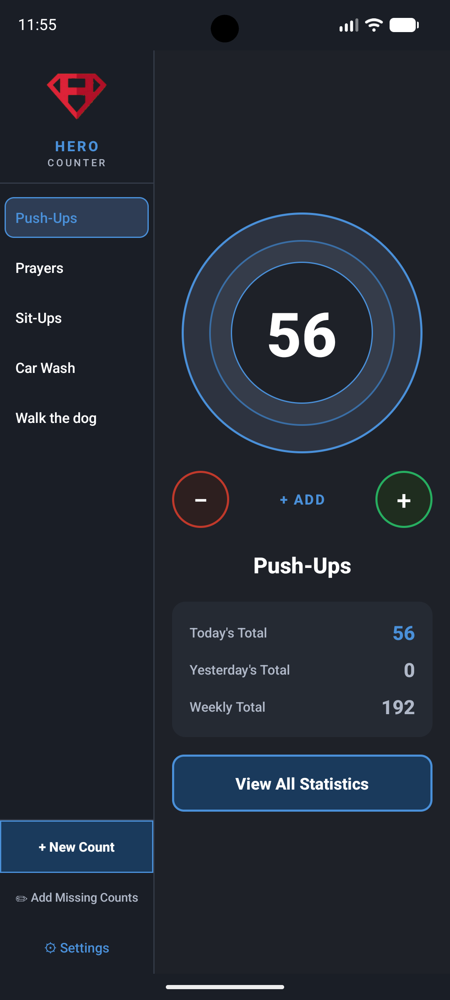
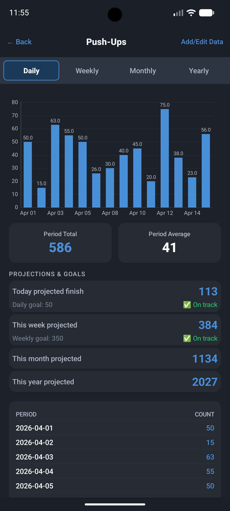
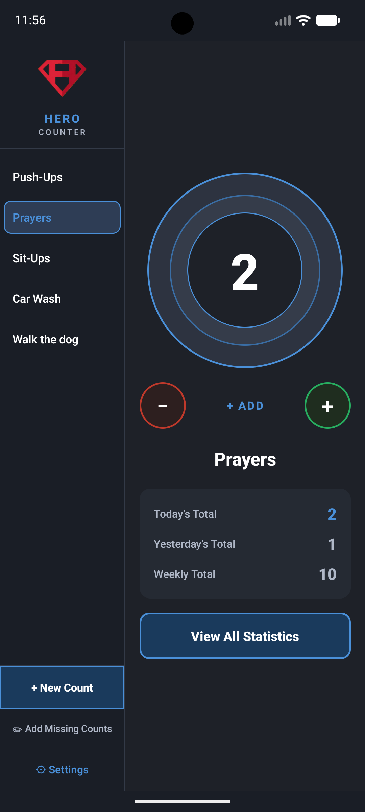
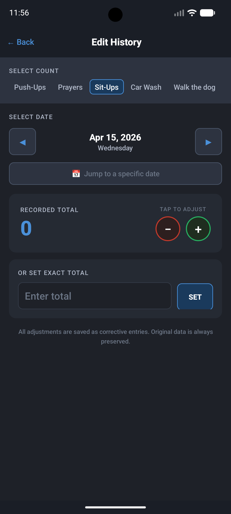
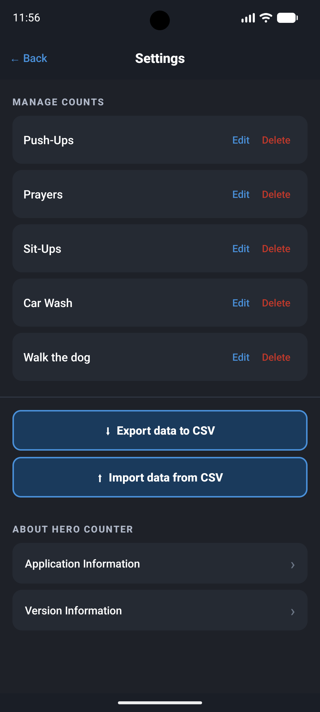

# Hero Counter

Because "what gets measured gets done."   Hero Counter is a private, offline habit and activity tracker for Android.  Hero Counter helps you track of your daily habits and progress to make you be a better version of yourself - for self-improvement and to help others.  Count anything that matters — push-ups, dog walks, medications, glasses of water, daily Bible reading, prayers, or any other repeating task — and track your progress over time.

---

## Screenshots

<p align="center">
  
  
  
  
  
</p>

---

## Features

- **Simple tap-to-count interface** — large circular counter with add and subtract modes
- **Multiple counts** — track unlimited named activities simultaneously
- **Daily goals** — set daily, weekly, monthly, and yearly targets per count
- **Statistics** — view bar charts and totals broken down by day, week, month, and year
- **Projected totals** — see where you are headed based on your current pace
- **Goal celebration** — fireworks animation plays when you hit your daily goal
- **Midnight auto-reset** — counter display resets each day automatically
- **Edit history** — add or correct entries for any past date, including before the app was installed
- **Reminders** — optional push notifications with configurable time and days of the week
- **CSV export** — export data for any or all counts with a timestamped filename; save locally or share via any app
- **CSV import** — restore data from a previous export on a new device or after reinstall; duplicate entries are skipped automatically
- **Privacy first** — no internet connection required, no ads, no trackers, no analytics, all data stays on device

---

## Privacy

Hero Counter is built on by design:

- No network permissions
- No third-party SDKs, analytics, or advertising libraries
- No data leaves your device unless you explicitly export it
- All data is stored locally in a SQLite database via Room
- CSV exports are unencrypted — the app warns you before completing any export

---

## Requirements

- Android 8.0 (API 26) or higher
- No Google Play Services required — works on de-Googled devices (Iode OS, CalyxOS, GrapheneOS, /e/OS, Lineage OS,etc.)

---

## Installation

This app is not available on the Google Play Store. Install via sideloading:

1. Build the APK in Android Studio: **Build → Build Bundle(s) / APK(s) → Build APK(s)**
2. Transfer `app-debug.apk` to your Android device
3. Enable **Install Unknown Apps** for your file manager in device Settings
4. Tap the APK to install

Alternatively, install via ADB:
```
adb install HeroCounter-v1.0pre.apk

```

---

## Building from Source

### Prerequisites
- Android Studio (latest stable)
- JDK 17 (use the Embedded JDK bundled with Android Studio)
- Android SDK with API 34

### Steps
1. Clone the repository:
   ```
   git clone https://github.com/YOURUSERNAME/HeroCounter.git
   ```
2. Open Android Studio → **File → Open** → select the `HeroCounter` folder
3. Let Gradle sync complete
4. **Build → Build Bundle(s) / APK(s) → Build APK(s)**

---

## Open-Source Libraries

Hero Counter is built on the following open-source libraries, each used under the Apache 2.0 License:

| Library | Purpose |
|---|---|
| AndroidX AppCompat | Activity and UI compatibility |
| Material Components for Android | UI components and theming |
| Room Persistence Library | Local SQLite database |
| MPAndroidChart | Bar charts in the Statistics screen |
| ConstraintLayout | Layout engine |

---

## Data & Backup

### Exporting
Go to **Settings → Export data to CSV** to export your data. You will be prompted to choose between saving locally or sharing via another app, and warned that the CSV file is unencrypted.

### Importing
Go to **Settings → Import data from CSV** to restore from a previous export. The app will:
- Create any counts that don't exist yet
- Import all historical entries
- Import all reminders associated with entries
- Skip any duplicate entries safely

### Database
Data is stored in a Room/SQLite database at the app's private storage location. It is not accessible to other apps without root access.

---

## Version

**Version 1.0** — Initial release
**Version 1.1** — Bug fixes and improvments

---

### Changelog

- Version 1.1 - Added the ability to reorder counts within settings menu.
- Version 1.1 - Added a feature where users can send a share link for the app....help spread the word!
- Version 1.1 - Fixed bug where reminders were not importing from CSV.
- Version 1.1 - Fixed bug where after deleting a count, the reminders remained active.

---

## License

This project is private and not licensed for public distribution or modification without permission.
